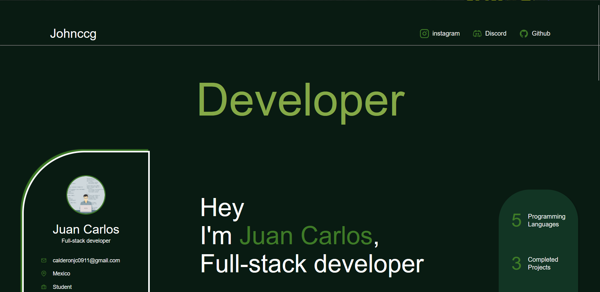
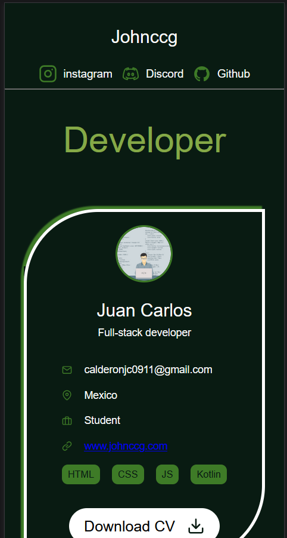

# Portfolio
Personal Portfolio Website
📖 Project Overview

This is a single-page responsive portfolio website created as part of a lab assignment. The website showcases personal information, and contact details. It is built using HTML, and CSS.

  [URL Link to website portfolio](https://johnccg.github.io/Portfolio/)
  
  [URL Link to website design](https://www.figma.com/design/Mu1LEFpJH6vvw16V7F3drs/Web-Developer-Portfolio-Website-Template--Community-?node-id=44-1143&t=AEV05dxZi0cRQ1sn-1)

🎯 Purpose

The goal of this project is to:

* Practice responsive web design techniques
* Learn how to structure and style a webpage
* Showcase personal or sample projects in a professional format

👥 Target Audience

This portfolio is designed for:

* [✅] Potential employers or recruiters

🧱 Technologies Used

* HTML5
* CSS3 (Flexbox, Box Models, Media Queries)

📐 Layout & Sections

The website includes the following sections:

* Header – Name and tagline
* About Me – Short bio and photo
* Contact – Email, social media, or contact form

📱 Responsiveness

The site is optimized for:

* Desktop
* Mobile

Responsive design is achieved using media queries and flexible layouts.

🧪 How to Run Locally
    Open your code editor (e.g., Visual Studio Code, etc.).
    In your code editor, open the terminal.
    Clone the repository:
    
    git clone https://github.com/your-username/portfolio-website.git

    Open index.html in your browser, or run the website locally using the Live Server Extension.

📂 Folder Structure
    
    portfolio-website/
    │
    ├── index.html
    ├── style.css
    ├── images/
    └── README.md

📄 Notes

* I designed the color scheme using Color Hunt: https://colorhunt.co/.
* I wrote the project descriptions and contact section manually.
* Design based in this template, adapting the visuals and text to fit my person: https://www.figma.com/community/file/1308624569713896610

📸 Screenshots

